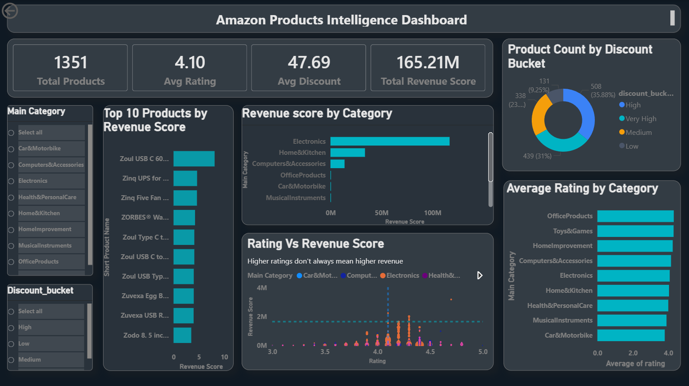

# 🛒 Amazon Product Intelligence Dashboard  
### End-to-End E-Commerce Analytics Project | Python • MySQL • Power BI

---

## 📌 Project Overview

The **Amazon Product Intelligence Dashboard** is an end-to-end analytics project designed to transform raw Amazon product listing data into actionable business insights.  
It analyzes pricing, discounts, ratings, reviews, and category performance to help simulate data-driven merchandising and pricing decisions for e-commerce businesses.

---

## 🎯 Business Objective

This project aims to answer key business questions such as:

- Which product categories generate the highest revenue potential?
- What discount ranges drive the strongest performance?
- Do higher-rated products correlate with stronger revenue?
- Which products appear undervalued despite strong ratings?
- How can pricing and discount strategies be optimized?

---

## 🧰 Tech Stack

- **Python** – Data Cleaning & Feature Engineering  
- **Pandas / NumPy** – Data Processing  
- **MySQL** – Data Modeling & SQL Analytics  
- **Power BI** – Dashboard Development  
- **Git/GitHub** – Version Control  

---

## 📂 Dataset

### Raw Dataset Source
🔗 **Kaggle Dataset:**  
[(https://www.kaggle.com/datasets/karkavelrajaj/amazon-sales-dataset)]

---

## 🏗 Project Workflow

This project follows a complete analytics pipeline from raw data ingestion to business intelligence reporting.

### 1. Data Collection
- Sourced raw Amazon product listing dataset from Kaggle  
- Collected pricing, discount, category, rating, and review information  

---

### 2. Data Cleaning & Preprocessing (Python)
- Removed duplicate records  
- Handled missing/null values  
- Standardized inconsistent formats  
- Converted price/rating fields to numeric  
- Cleaned categorical text columns  

---

### 3. Feature Engineering
Created analytical columns to improve business insight generation:

- **Revenue Score** → Proxy metric representing earning potential  
- **Discount Bucket** → Grouped discounts into ranges  
- **Rating Segment** → Categorized products by rating tiers  
- **Price Gap** → Difference between actual and discounted price  
- **Main Category** → Extracted primary category from hierarchical category  

---

### 4. Data Warehousing (MySQL)
- Loaded cleaned data into MySQL  
- Designed relational schema for analytics  
- Created fact and dimension tables  

---

### 5. Advanced SQL Analysis
Performed business-focused SQL analysis to answer:

- Which categories generate the most revenue?  
- What discount buckets perform best?  
- Do ratings impact revenue?  
- Which products are underpriced/overpriced?  
- Which categories show highest engagement?  

---

### 6. Dashboard Development (Power BI)
Built interactive dashboard with:

- KPI Cards  
- Revenue & Discount Visualizations  
- Product Performance Charts  
- Category Analysis  
- Interactive Filters/Slicers  

---

### 7. Business Insight Generation
Generated actionable recommendations for:

- Pricing Optimization  
- Discount Strategy  
- Product Prioritization  
- Category Investment Decisions  

---

## 🗄 Database Schema

### Dimension Table
- `products_dim`

### Fact Tables
- `pricing_fact`
- `reviews_fact`

---

## 📊 Dashboard Preview

> Upload dashboard screenshot here: `amazon_product_intelligence_dashboard.png`



---

## 📌 Dashboard Features

### KPI Cards
- Total Products  
- Average Rating  
- Average Discount %  
- Total Revenue Score  

### Visualizations
- Revenue by Category  
- Discount Bucket Analysis  
- Rating vs Revenue Scatter Plot  
- Top Products by Revenue  
- Rating Distribution  

### Interactive Filters
- Main Category  
- Discount Bucket  
- Rating Segment  

---

## 💡 Key Insights

- Moderate discounts often outperform excessive discounting  
- Electronics and Computer Accessories dominate revenue contribution  
- Higher-rated products generally correlate with stronger revenue  
- Several highly rated products appear undervalued  

---

## 📁 Repository Structure

```text
## 📁 Repository Structure

amazon-product-intelligence/
│
├── 01_data_cleaning.ipynb                # Data cleaning and preprocessing notebook
├── Amazon Product Intelligence business... # Business problem / documentation file
├── Amazon Products Intelligence Da...      # Dashboard/Project documentation file
├── Amazon_Product_Intelligence.pptx        # Project presentation deck
│
├── advanced_analysis.sql                  # Advanced SQL business analysis queries
├── amazon.csv                             # Raw dataset
├── amazon_product_intelligence_da...      # Power BI dashboard file (.pbix)
├── populate_tables.sql                    # SQL script to populate tables
├── requirements.txt                       # Python dependencies
├── schema_design.sql                      # Database schema creation script
│
└── README.md                              # Project documentation
